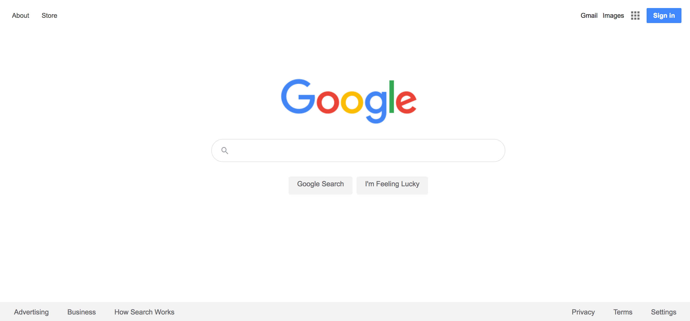

# Google Homepage

> Google search engine.

---

### Table of Contents

- [Description](#description)
- [References](#references)
- [License](#license)
- [Author Info](#author-info)

---

## Description

This project was completed in accordance to the Web Development Foundations on The Odin Project. The objective was to reconstruct an existing webpage (Google Homepage), in an effort to understand how elements are placed on a page and in relation to each other using HTML and CSS. 

#### Technologies

- HTML
- CSS

[Back To The Top](#google-homepage)

---

## References
https://www.theodinproject.com/courses/foundations/lessons/html-css

[Back To The Top](#google-homepage)

---

## License

Creative Commons License

Copyright (c) [2020] [The Other Brian Williams]

This project is licensed under the Creative Commons Attribution-NonCommercial-ShareAlike 4.0 International License.

[Back To The Top](#google-homepage)

---

## Author Info

- Github - [TheOtherBW](https://github.com/theotherbw)

[Back To The Top](#google-homepage)
